# 🏥 Clinic Management System

A full-stack **Clinic Management System** built with **Laravel** to simplify clinic operations. The system allows managing patients, doctors, appointments, medical records, and secure online payments using **Paymob**. It also implements **Role-Based Access Control (RBAC)** using **Spatie Laravel Permission** with a modern responsive UI built using **Tailwind CSS**.

---

# ✨ Features

- Authentication
- Dashboard
- Patient Management
- Doctor Management
- Doctor Schedules
- Appointment Booking
- Medical Records
- Online Payments (Paymob)
- Notifications
- Roles & Permissions
- Service Layer Architecture

---

# 📸 Project Screenshots

---

## 🔐 Login

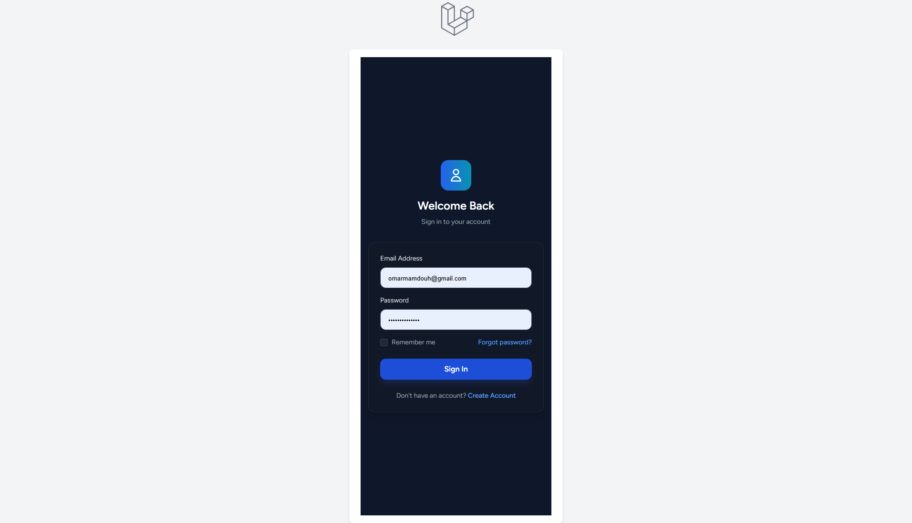

The login page provides secure authentication using Laravel Breeze. Only authenticated users can access the system, while each user can only access the features allowed by their assigned role and permissions.

---
---

## 📝 Register

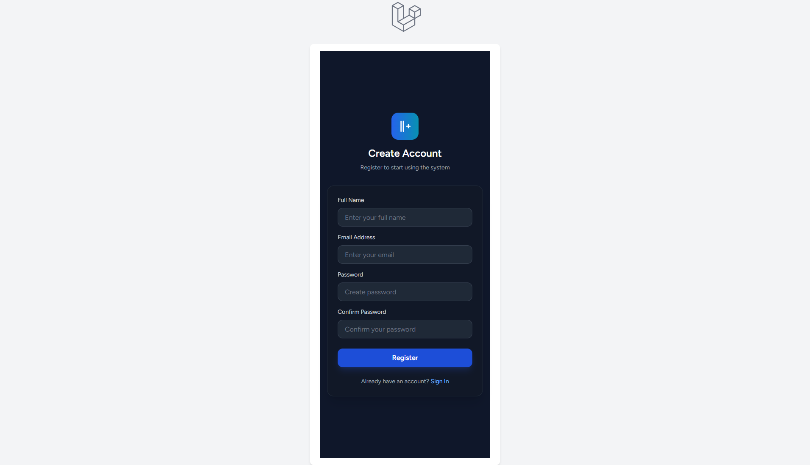

The registration page is powered by Laravel Breeze and provides a secure way to create new accounts. User passwords are encrypted before storage, and newly created users can be assigned different roles and permissions to control their access throughout the system.

---
## 📊 Dashboard

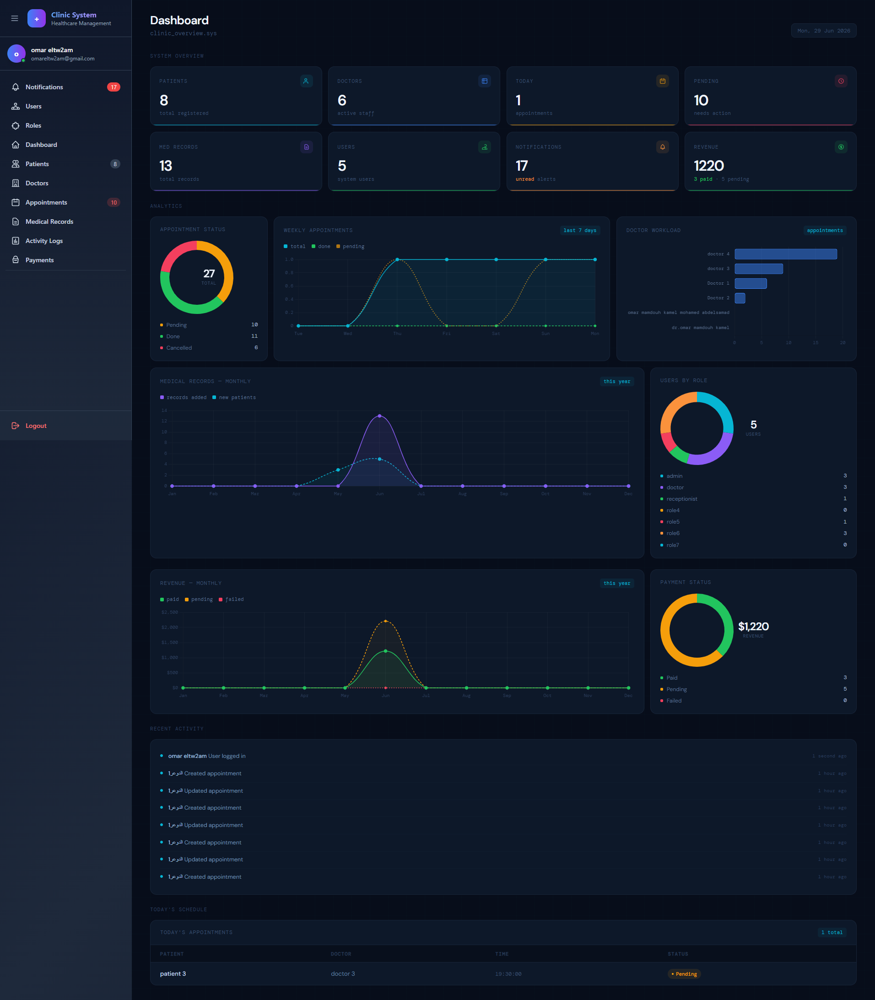

The dashboard provides an overview of the clinic and acts as the starting point after login. It allows quick navigation between all modules of the system.

---

## 👨‍⚕️ Doctors

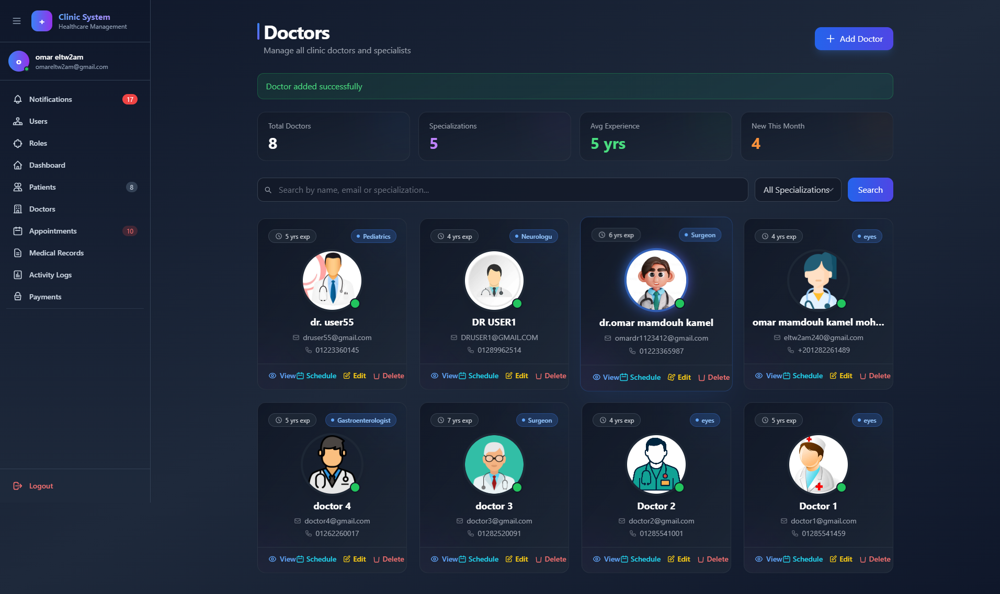

Manage doctors by creating, editing, deleting, and viewing their information. Every doctor has personal details, specialty, and an assigned work schedule.

---

## 📅 Doctor Schedule

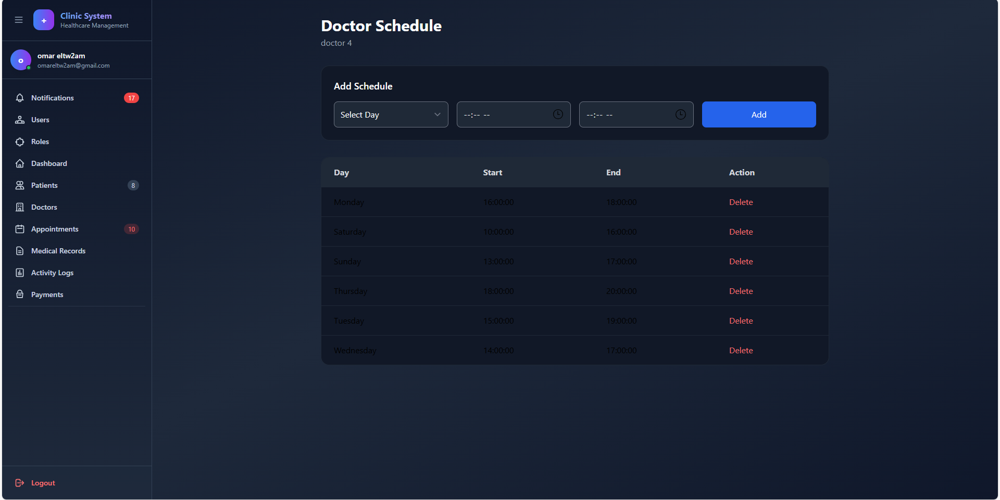

Configure weekly working schedules for each doctor. Appointment booking is validated against these schedules to prevent unavailable bookings.

---

## 👥 Patients

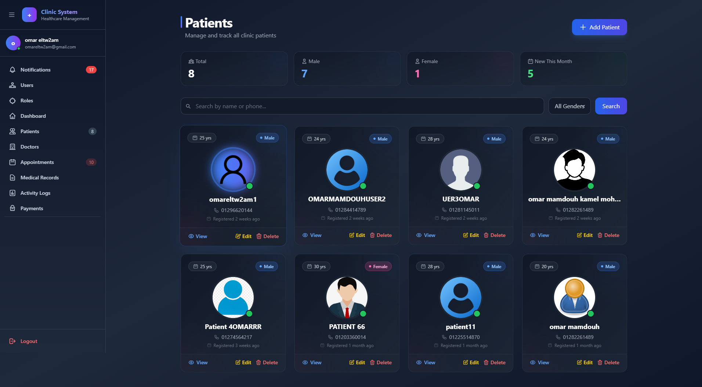

Manage patient records including creating new patients, editing their information, viewing their profiles, and maintaining their medical history.

---

## 📅 Appointments

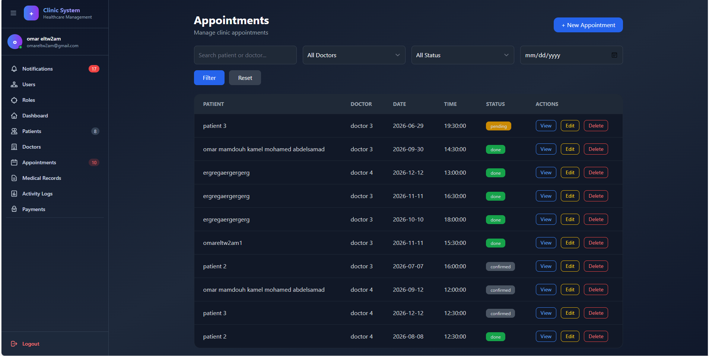

Manage appointments between doctors and patients. The system validates doctor availability before allowing appointments to be booked.

---

## ➕ Create Appointment

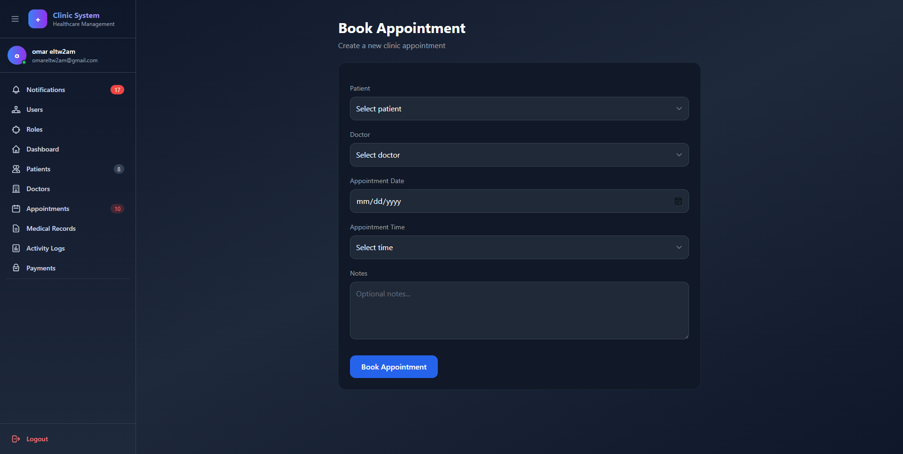

Receptionists can create appointments by selecting the patient, doctor, available date, and available time slot.

---

## 📋 Medical Records

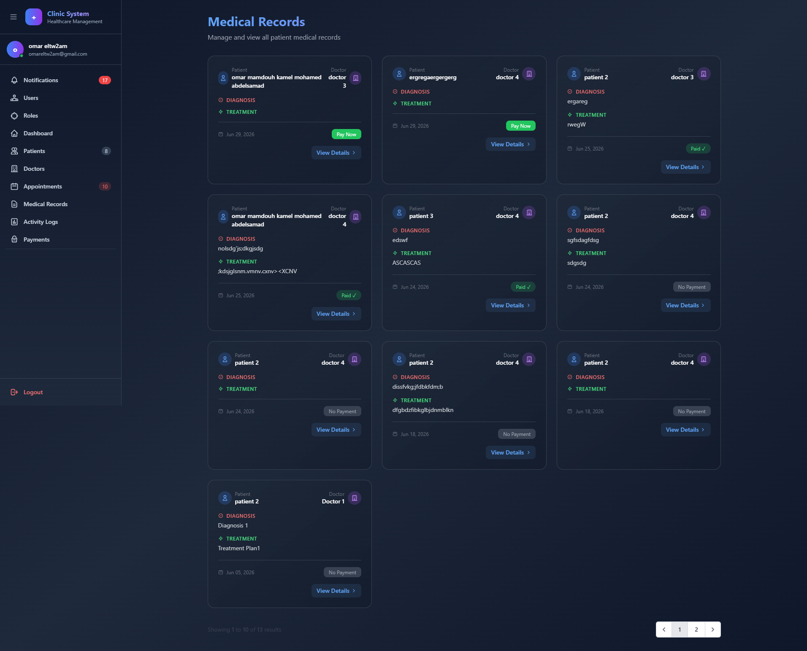

Doctors can create complete medical records containing diagnosis, treatment plans, additional notes, and visit fees.

---

## 📄 Medical Record Details


Displays all information related to a patient's visit including diagnosis, treatment, notes, payment status, and visit fee.

---

## 💳 Payments

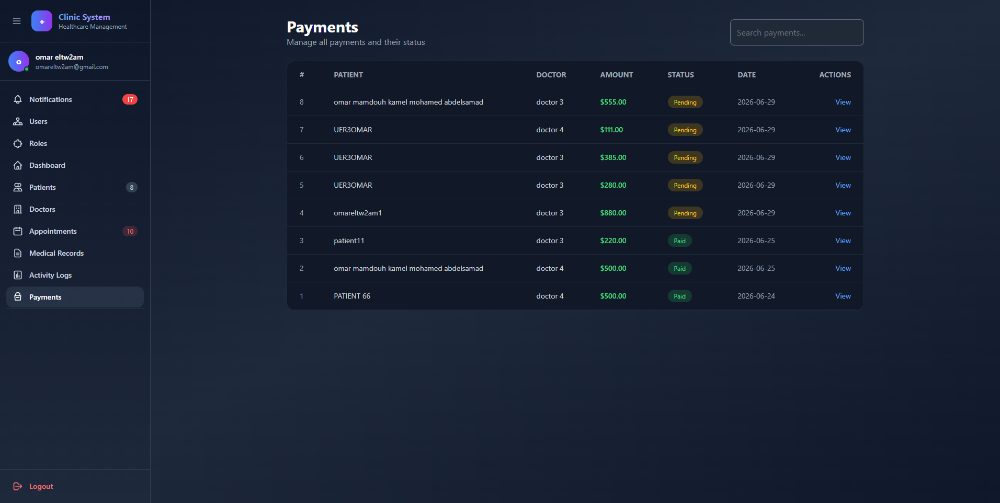

Every medical record can generate an online payment. Users can monitor payment status including Pending, Paid, and Failed transactions.

---

## 🌐 Paymob Payment


Secure online payment integration using the Paymob API. The implementation includes payment authentication, order creation, payment keys, iframe checkout, and webhook handling.

---

## 👤 User Management

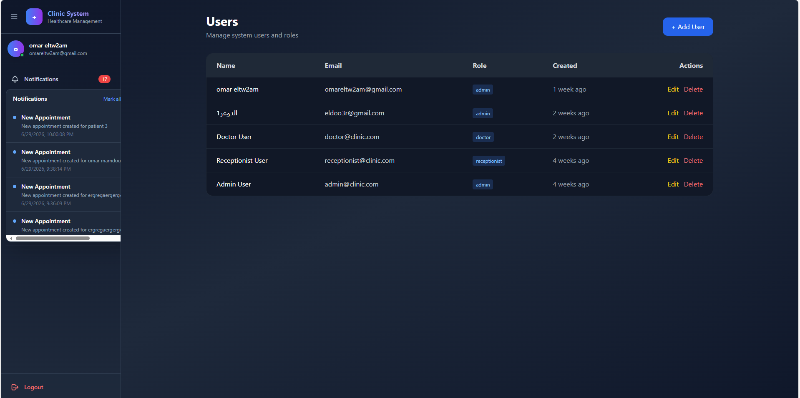

Administrators can manage all system users, assign roles, edit accounts, and remove users whenever necessary.

---

## 🔑 Roles & Permissions

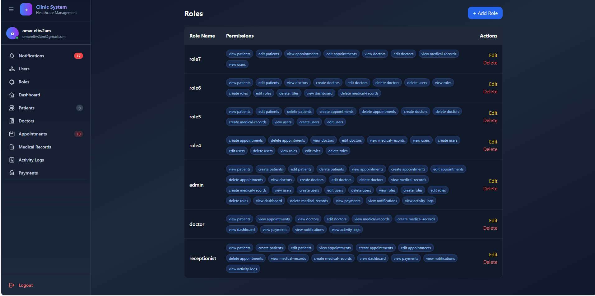

Role-Based Access Control is implemented using Spatie Laravel Permission.

Supported Roles:

- Admin
- Doctor
- Receptionist

Permissions are assigned separately for:

- Patients
- Doctors
- Appointments
- Medical Records
- Payments
- Users
- Roles

---

# 🛠 Technologies

- Laravel
- PHP
- MySQL
- Blade
- Tailwind CSS
- Laravel Breeze
- Spatie Laravel Permission
- Paymob API

---

# 🚀 Installation

```bash
git clone https://github.com/omar571mamdouh/Clinic-Management-System.git

cd Clinic-Management-System

composer install

npm install

cp .env.example .env

php artisan key:generate

php artisan migrate --seed

npm run dev

php artisan serve
```

# 👨‍💻 Author

**Omar Mamdouh**

Laravel Backend Developer

GitHub:
https://github.com/omar571mamdouh